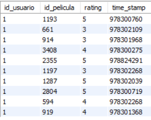

### Session 1x07: Local databases configuration

#### Work

#### Post-Work
* [Challenge01](Challenge01.sql)

1. Definir los campos y tipos de datos para la tabla movies haciendo uso de los archivos movies.dat y README.

2. Crear la tabla movies (recuerda usar el mismo nombre del archivo sin la extensión para vincular nombres de tablas con archivos).

```SQL
CREATE TABLE IF NOT EXISTS movies (
   id_pelicula INT PRIMARY KEY,
   titulo VARCHAR(50),
   genero VARCHAR(50)
);
```

3. Definir los campos y tipos de datos para la tabla ratings haciendo uso de los archivos ratings.dat y README.

4. Crear la tabla ratings (recuerda usar el mismo nombre del archivo sin la extensión para vincular nombres de tablas con archivos)

```SQL
CREATE TABLE IF NOT EXISTS ratings (
   id_usuario INT,
   id_pelicula INT,
   rating INT,
   time_stamp BIGINT,
   FOREIGN KEY (id_usuario) REFERENCES users(id),
   FOREIGN KEY (id_pelicula) REFERENCES movies(id_pelicula)
);
```

* [Challenge02](Challenge02.sql)
1. Usando como base el archivo movies.dat, limpiarlo e importar los datos en la tabla movies creada en el Reto 1.

```SQL
SELECT * FROM movies LIMIT 10;
```


2. Usando como base el archivo ratings.dat, limpiarlo e importar los datos en la tabla ratings creada en el Reto 2.

```SQL
SELECT * FROM ratings LIMIT 10;
```



#### Excercises(Optional)
[Excercises 7](Excercises/README.md)


[Back](../README.md)
